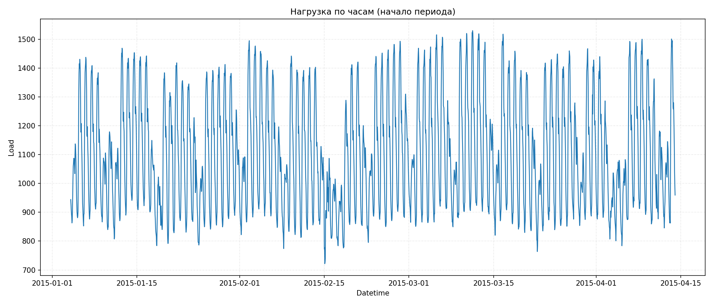
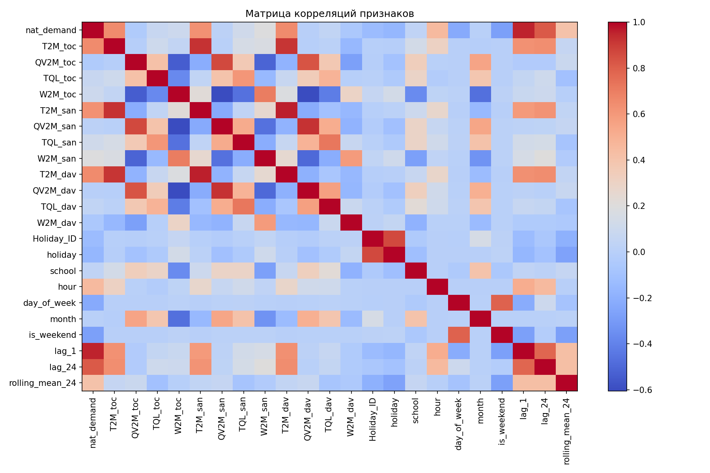
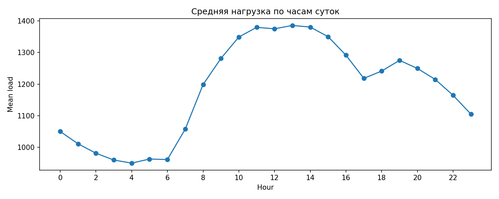

# Отчёт по проекту

**Студент:** Денисова Алиса Евгеньевна
**Группа:** БИВ231

---

## 1. Введение и постановка задачи

- **Цель проекта:** прогнозировать почасовой спрос на электроэнергию по погодным и календарным признакам
- **Формулировка задачи:** регрессия
- **Обоснование метрики качества:** основная метрика качества - `MAE`, потому что она измеряется в тех же единицах, что и нагрузка, и её проще интерпретировать. Дополнительно используется `RMSE` для контроля крупных ошибок

---

## 2. Поиск и описание данных

- **Источник данных:** датасет Electricity Load Forecasting на Kaggle. Хороший по объему, прикладная задача. Ссылка: https://www.kaggle.com/datasets/saurabhshahane/electricity-load-forecasting
- **Описание датасета:**
  - объём: `48048` строк, `17` столбцов
  - целевой столбец: `nat_demand`
  - временной столбец: `datetime`

---

## 3. Обработка и подготовка данных

- **Полная очистка:**
  - дубликаты: обнаружено `0`, удаление реализовано
  - пропуски по таргету: `0`, удаление реализовано
  - выбросы: удаление по IQR-правилу (`1.5 * IQR`), удалено `7` строк
  - типы: `datetime` приведен к datetime, таргет к numeric
- **Работа с фичами:**
  - исходно: 17 признаков/столбцов
  - добавлены признаки: `hour`, `day_of_week`, `month`, `is_weekend`, `lag_1`, `lag_24`, `rolling_mean_24`
  - календарные признаки дают контекст времени, а лаги автозависимость временного ряда
- **Визуализации:**
  - `images/eda_load_curve.png`: фрагмент временного ряда
  - `images/eda_corr_heatmap.png`: матрица корреляций
  - `images/eda_hourly_pattern.png`: средняя нагрузка по часам
- **Сплит данных:**
  - split по времени: `70% train / 15% val / 15% test`
  - shuffle не используется
  - данные из будущего не попадают в train относительно val/test

---

## 4. Baseline-модель

- **Модель:** `baseline_raw_linear` (`LinearRegression`) без feature engineering
- **Результаты:**
  - `val_mae = 114.78`, `val_rmse = 139.74`
  - `test_mae = 137.17`, `test_rmse = 167.52`
- **Цель:** точка отсчёта для сравнения с более сложными моделями

---

## 5. Эксперименты

1. **Гипотеза:** без FE качество хуже
   **Проверка:** `baseline_raw_linear` vs модели на полном наборе признаков
   **Результат:** baseline без FE значительно хуже по всем метрикам

2. **Гипотеза:** ансамбли деревьев лучше линейных моделей
   **Проверка:** `random_forest`, `xgboost`, `xgb_small` vs `ridge`
   **Результат:** ансамбли дают меньшие `MAE/RMSE`

3. **Гипотеза:** гиперпараметры влияют на качество
   **Проверка:** `rf_200` vs `random_forest`, `xgb_small` vs `xgboost`
   **Результат:** `xgb_small` оказался лучшим по `val_mae`

Таблица экспериментов:

| Модель              | Feature set   | Val MAE | Val RMSE | Test MAE | Test RMSE |
| ------------------- | ------------- | ------: | -------: | -------: | --------: |
| xgb_small           | full_features |   15.61 |    22.85 |    22.35 |     31.82 |
| xgboost             | full_features |   15.97 |    24.73 |    23.43 |     34.31 |
| random_forest       | full_features |   16.54 |    25.22 |    23.21 |     33.85 |
| rf_200              | full_features |   16.71 |    25.45 |    23.34 |     33.90 |
| baseline_linear     | full_features |   37.08 |    49.15 |    35.81 |     46.75 |
| ridge               | full_features |   37.31 |    49.57 |    35.76 |     46.81 |
| knn                 | full_features |   45.47 |    58.81 |    68.18 |     90.51 |
| baseline_raw_linear | raw_only      |  114.78 |   139.74 |   137.17 |    167.52 |

---

## 6. Финальная модель и интерпретируемость

- **Финальная модель:** `xgb_small`, т.к. у неё лучший `val_mae`
- **Интерпретируемость:**
  - результат показывает, что лаговые признаки (`lag_1`, `lag_24`, `rolling_mean_24`) полезны
  - погодные признаки также вносят вклад, но меньше, чем лаги в краткосрочном прогнозе

---

## 7. Деплой (на CP3 будет :-D )

- **Интерфейс:** если требуется по задаче (Streamlit, Telegram-бот и т.д.)
- **API:** FastAPI или аналог - описание эндпоинтов, примеры запросов
- **Скриншоты** работы интерфейса/API
- **Ссылка на видео** демонстрации работы

---

## 8. Заключение и выводы

- **Итоги:**
  - собран воспроизводимый пайплайн подготовки и обучения
  - получена рабочая модель с заметным улучшением относительно baseline
- **Ограничения:**
  - интерпретация признаков пока базовая
  - модель обучена на одном датасете, ничего внешнего не использовалось
- **Возможные улучшения:**
  - расширить подбор гиперпараметров
  - добавить улучшенную интерпретацию
  - реализовать деплой

---

## 9. Приложение: визуализации

### Временной ряд нагрузки

### Матрица корреляций признаков

### Средняя нагрузка по часам

